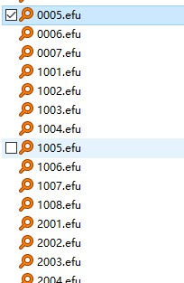
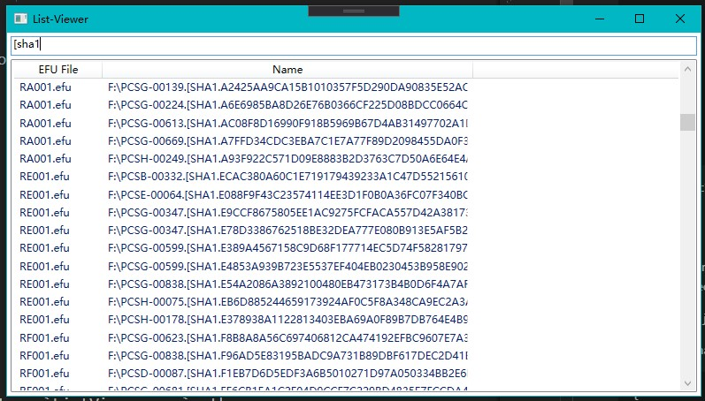

# List-Viewer

A configureable list viewer.

## Simplest Example

If you have a ton .efu files (created by everything)



You can add a json configuration

``` json
{
    "Title": "List-Viewer",
    "Columns": [
        {
            "ColumnName": "EFU File",
            "ColumnField": "FileName",
            "IsContextField": true
        },
        {
            "ColumnName": "Name",
            "ColumnField": "Filename"
        }
    ],
    "Sources": [
        {
            "Provider": "dir",
            "DirPath": "C:\\YourDir",
            "SubDirDepth": 999,
            "Templates": {
                ".efu": {
                    "Provider": "csv"
                }
            }
        }
    ]
}
```

Drop it on `ListViewer.exe`, then ...



Here is a searchable list viewer.

## Configure

By default, when you launch `ListViewer.exe` without arguments,
ListViewer will load `lv-config.json` from application directory.

You can drop a json config file on `ListViewer.exe` to use specials config file.

Config file format:

``` json
{
    "Title": "the title of main window",
    "Columns": [...],
    "Sources": [...]
}
```

### `Columns` Values

``` json
{
    // the title of column name, leave null/empty to use ColumnField.
    "ColumnName": "",

    // the field to load from source
    "ColumnField": "",

    // is search on this column or not, default value is true
    "SearchOn": true,

    // is display on main window or not, default value is true
    "IsDisplay": true,

    // is the column field from context,
    // for example, "FileName" can read from context.
    "IsContextField": false
}
```

### `Sources` Values

#### Common

``` json
{
    // the option field map
    "FieldMap": {
        "column-name-from-data-source": "list-viewer-field-name"
    },
    // options for load entire table to memory, default value is false
    "LoadEntireTableToMemory": false
}
```

#### Sqlite table

``` json
{
    "Provider": "sqlite3",
    "ConnectionString": "...",
    "Table": "...",
}
```

#### Other data file

``` json
{
    // one of "csv"
    "Provider": "",
    // the file path
    "FilePath": "",
    // leave null/empty to use utf-8
    "Encoding": "",
}
```

#### Files from a directory

``` json
{
    "Provider": "dir",
    // the directory path
    "DirPath": "",
    "SubDirDepth": 0,
    "Templates": {
        // key is the extension name, like ".csv"
        "": {
            // one of "csv"
            "Provider": "",
            // leave null/empty to use utf-8
            "Encoding": "",
            // the option field map
            "FieldMap": {
                "csv-column-name": "list-viewer-field-name"
            }
        },
        ...
    }
}
```
